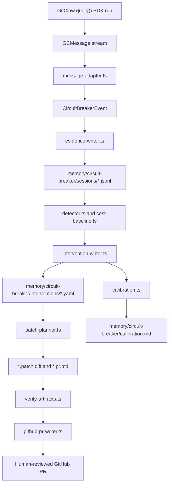

# GitClaw Circuit Breaker Architecture

## Architecture Verdict

This is a real agent workflow design when it is evaluated as an evidence-to-review
control loop:

1. GitClaw runs the agent and emits SDK `GCMessage` events.
2. The circuit breaker adapts only the event types it needs into a stable local
   event contract.
3. Evidence is persisted as replayable JSONL with monotonic `eventIndex` values.
4. Deterministic detectors inspect the replayable evidence, not live model text.
5. Findings become intervention records with exact evidence indexes.
6. Patch planning proposes the smallest repo-native change.
7. Optional GitHub mode opens a human-reviewable PR only after artifact checks pass.

That makes the example stronger than a wrapper demo. The core system boundary is
not a custom agent runtime; it is a reliability layer around GitClaw's real SDK
stream.

## Component Diagram

## Runtime Boundary

| Layer | Files | Responsibility |
|---|---|---|
| GitClaw runtime | `src/sdk.ts`, `src/sdk-types.ts`, `dist/exports.js` | Runs the actual agent and emits SDK messages. |
| Capture wrapper | `examples/circuit-breaker/run.ts` | Chooses regression or live mode, consumes SDK messages, applies output caps. |
| Normalized event boundary | `message-adapter.ts` | Converts `GCMessage` into detector-safe `CircuitBreakerEvent` records. |
| Durable evidence | `evidence-writer.ts` | Writes replayable session JSONL with stable `sessionId` and `eventIndex`. |
| Detection | `detector.ts`, `cost-baseline.ts` | Detects paired low-progress tool loops and classifies cost anomalies. |
| Intervention | `intervention-writer.ts`, `patch-planner.ts` | Writes traceable YAML records and targeted patches/PR bodies. |
| External review | `github-pr-writer.ts` | Creates or reuses a branch and PR after local proof artifacts exist. |
| Proof tooling | `demo.sh`, `live-proof.sh`, `pr-proof.sh`, `verify-artifacts.ts` | Separates regression checks from live SDK and live PR submission proof. |
| Calibration | `calibration.ts` | Summarizes pending, merged, and rejected interventions without inflated precision. |

## Key Design Decisions

| Decision | Why it matters |
|---|---|
| SDK-first capture | Avoids building a second runtime or fake agent loop. |
| Normalized event contract | Keeps detector logic independent from raw provider/runtime message details. |
| JSONL evidence with event indexes | Makes every finding replayable, inspectable, and citeable. |
| Paired `tool_use` + `tool_result` loop detection | Prevents firing on intent alone when the tool result is missing. |
| Deterministic result delta | Avoids judging progress through vague text similarity. |
| Baseline-before-update cost analysis | Prevents anomalous samples from poisoning the clean baseline. |
| Advisory PR flow | Preserves human review and avoids unsafe automatic production blocking. |
| Calibration with pending decisions | Makes the system honest until humans label outcomes. |

## Reviewer Checklist

- [ ] Fresh clone uses Node.js 20+ and `npm ci`.
- [ ] `npm run build` passes before any live proof.
- [ ] `npm test` passes and covers adapter, evidence, detector, patch planner, runner, PR writer, calibration, and docs.
- [ ] `examples/circuit-breaker/demo.sh` writes fixture evidence, one loop intervention, patch, PR body, calibration, and low-sample cost warning as regression coverage only.
- [ ] `examples/circuit-breaker/live-proof.sh` captures a real provider-backed `query()` event stream with explicit `MAX_TOKENS`.
- [ ] `examples/circuit-breaker/pr-proof.sh` runs live SDK capture before opening or reusing a GitHub PR.
- [ ] `examples/circuit-breaker/PROOF.md` separates regression checks from live provider proof and live PR proof.
- [ ] The README does not claim production interception, automatic merge, or statistically meaningful precision before labels exist.

## Risk Register

| Risk | Current mitigation |
|---|---|
| Reviewer mistakes fixture proof for live proof | README and proof report state fixtures are regression only, not submission proof. |
| Detector fires on repeated text with no stable result identifiers | Primary detection returns `unknown` result delta and does not fire. |
| Cost spike handling overclaims statistics | Statistical anomaly requires at least five clean baseline samples. |
| PR mode changes remote state unexpectedly | PR mode is called out as an external side effect and requires live SDK evidence before opening a PR. |
| Base GitClaw repo has large files unrelated to the example | Circuit-breaker architecture is isolated under `examples/circuit-breaker/` and tested separately. |

## What Stays Human

The circuit breaker proposes. A human still reviews the evidence, decides whether
the intervention is valid, merges or rejects the PR, and records that outcome for
calibration. This is the right trust boundary for v1.
